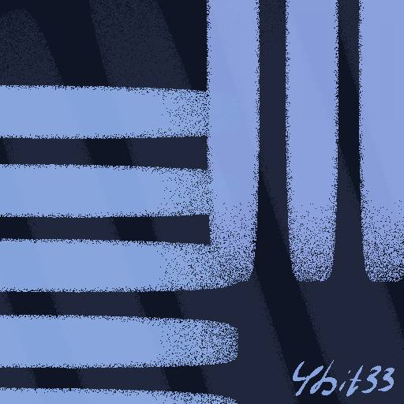

# CUI - CustomUI


[English version](README.md)

Fabric-мод для Minecraft Java Edition, який дозволяє повністю замінити фон
головного меню: статичне зображення, GIF, відео (WebM/MP4), власну панораму
з 6 граней та власну музику меню — без ручного редагування ресурс-паків.
Також включає розширюваний фреймворк для налаштування UI.

## Версії (важливо прочитати)

- **Цільова версія Minecraft: 1.21.11**, Fabric Loader `0.18.1`, Fabric API
  `0.141.6+1.21.11`, Yarn mappings `1.21.11+build.6`.
- Проєкт оновлено до версії гри 1.21.11, що є актуальною стабільною версією.
  Для портування на новіші версії (напр. 26.x) необхідно:
  1. оновити `minecraft_version`, `yarn_mappings`, `loader_version`,
     `fabric_version` у `gradle.properties`;
  2. перевірити (і за потреби перейменувати через "Refactor" у IntelliJ
     після Gradle-синку) цілі в mixin-ах у пакеті `com.cmb.cui.mixin`.
     Mixin одразу покаже помилку запуску, якщо ціль не знайдена.

## Структура проєкту

```
build.gradle, settings.gradle, gradle.properties   — Gradle/Loom конфігурація
src/main/resources/fabric.mod.json                 — маніфест мода
src/main/resources/cui.mixins.json                 — конфігурація Mixin
src/main/java/com/cmb/cui/
    client/CUIClient.java             — точка входу (ClientModInitializer)
    client/render/                    — BackgroundManager + рендерери
    config/                           — ModConfig (POJO) + ConfigManager
    audio/                            — CustomMusicPlayer (OpenAL)
    gui/                              — ModSettingsScreen + ModMenuIntegration
    mixin/                            — Mixin-и (TitleScreen, Panorama, Music)
```

Код навмисно модульний: `BackgroundManager` нічого не знає про Mixin, а
`TitleScreenMixin` нічого не знає про декодування відео/GIF — кожен
рендерер (`StaticImageBackgroundRenderer`, `GifBackgroundRenderer`,
`VideoBackgroundRenderer`, `PanoramaBackgroundRenderer`) реалізує один і
той самий інтерфейс `BackgroundRenderer` (`tick`/`render`/`close`), тож
додати новий тип фону в майбутньому — це один новий клас плюс один `case`
у `BackgroundManager.rebuild()`.

## 1. Встановлення Fabric

1. Встановіть Java 21+.
2. Завантажте **Fabric Loader** з https://fabricmc.net/use/installer/ і
   встановіть його для потрібної версії Minecraft (`1.21.11`), обравши
   профіль лаунчера "fabric-loader-...".
3. Завантажте відповідну версію **Fabric API** з Modrinth/CurseForge для
   тієї ж версії гри і покладіть `.jar` у папку `mods/`.

## 2. Встановлення мода

1. Зберіть мод (`./gradlew build`, див. нижче) або завантажте вже зібраний
   `.jar`.
2. Покладіть `cui-<version>.jar` у папку `.minecraft/mods/`
   поруч із Fabric API.
3. Запустіть Minecraft через профіль Fabric — при першому запуску мод сам
   створить структуру папок, описану нижче.

## 3. Розташування кастомних файлів

Мод створює (якщо їх ще немає) таку структуру в папці гри:

```
.minecraft/cui/
    config/cui.json    — файл конфігурації
    images/            — PNG / JPG / WebP (статичні фони) та GIF (анімовані)
    videos/            — WebM / MP4
    panorama/          — panorama_0.png ... panorama_5.png (власна панорама)
    audio/             — OGG (кастомна музика меню)
    music/             — (аліас для audio/ для зворотної сумісності)
```

Просто киньте файл у відповідну папку — він одразу зʼявиться у списку
вибору файлу в меню налаштувань мода (кнопка **"Menu Backgrounds..."** у
правому нижньому куті головного меню або через ModMenu).

## 4. Формати файлів

| Тип фону         | Формати               | Примітка |
|------------------|------------------------|----------|
| Статичне зображення | PNG, JPG, WebP      | PNG декодується нативно, JPG — через `javax.imageio`, WebP — потребує наявності WebP-рідера в JDK/класпасі |
| Анімований GIF   | GIF                    | Усі кадри й затримки декодуються один раз при завантаженні |
| Відео            | WebM, MP4              | Через вбудований FFmpeg (JavaCV), декодування — окремий потік |
| Панорама         | PNG, 6 файлів `panorama_0..5.png` | Відсутні грані замінюються ванільними |
| Музика           | OGG (Vorbis)           | Декодується повністю у памʼять один раз, стрімінгу немає |

**Про WebP:** стандартний JDK не завжди має вбудований `ImageIO` рідер для
WebP. Якщо `.webp`-файли не завантажуються, додайте залежність
`org.sejda.imageio:webp-imageio` (або аналог) до `build.gradle` — місце
позначено коментарем у `ImageDecoding.java`.

**Про відео:** `VideoBackgroundRenderer` використовує JavaCV/FFmpeg
(`build.gradle`), що додає нативні бінарники FFmpeg під Windows/Linux/macOS
у jar — це суттєво збільшує розмір збірки (десятки МБ).

## 5. Налаштування

Меню налаштувань (кнопка на головному екрані) дозволяє:

- вибрати тип фону, конкретний файл і режим масштабування
  (Fill / Fit / Stretch / Center);
- регулювати яскравість, затемнення (overlay), швидкість
  анімації/відео, гучність відео, швидкість обертання панорами;
- увімкнути/вимкнути й налаштувати кастомну музику меню;
- **Preview** — застосувати зміни одразу, без збереження на диск;
- **Reset** — скасувати незбережені зміни (перечитати `cui.json`);
- **Save** — зберегти й застосувати конфігурацію;
- відкрити папку `cui/` в файловому менеджері ОС.

Формат `cui/config/cui.json` (приклад):

```json
{
  "backgroundType": "video",
  "background": "background.webm",
  "scaleMode": "fill",
  "brightness": 1.0,
  "overlayOpacity": 0.35,
  "videoLoop": true,
  "videoVolume": 0.0,
  "videoSpeed": 1.0,
  "panoramaRotationSpeed": 1.0,
  "customMusicEnabled": false,
  "customMusicFile": "",
  "customMusicLoop": true,
  "customMusicVolume": 1.0
}
```

## 6. Запуск і компіляція

Проєкт — стандартний Fabric Loom Gradle-проєкт, відкривається в IntelliJ
IDEA через "Open" → виберіть `build.gradle`.

```bash
# запуск клієнта прямо з Gradle (dev-середовище з мапінгами)
./gradlew runClient

# збірка готового мод-jar (буде у build/libs/)
./gradlew build
```

## Продуктивність

- **Відео** ніколи не перекодовується щокадру рендеру: окремий потік
  (`VideoBackgroundRenderer` → `decodeLoop`) декодує наступний кадр лише
  тоді, коли попередній уже спожитий і минув час одного кадру відео;
  `render()` лише перемальовує вже завантажену в GPU текстуру.
- **GIF** повністю декодується один раз при завантаженні (усі кадри +
  затримки), відтворення — це просто перемикання вже готових кадрів.
- **Панорама** тримає рівно 6 текстур граней, завантажених один раз.
- Усі рендерери реалізують `close()`, який викликається
  `BackgroundManager` при виході з головного меню — GPU-текстури знищуються,
  потік декодування відео зупиняється, OpenAL-джерело й буфер кастомної
  музики звільняються.

## Відомі обмеження / TODO

- WebP вимагає окремого ImageIO-рідера (див. розділ 4).
- Музика декодується повністю в памʼять — для дуже довгих треків варто
  замінити на стрімінговий OpenAL-буфер.
- Мод використовує Mixin для інтеграції в `TitleScreen`, `MusicTracker` та
  `RotatingCubeMapRenderer` (через `ScreenPanoramaMixin` та `PanoramaCancelMixin`).
